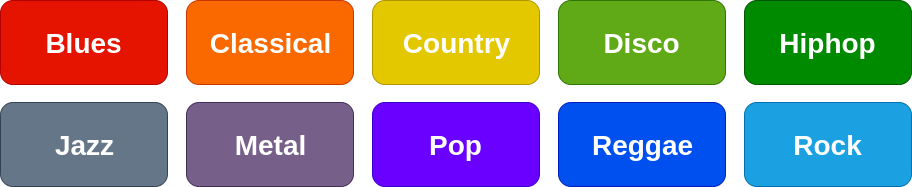

# GTZEN-MGC
Music Genre Classification of the popular GTZEN dataset. 


# Saish Jaiswal

### jaiswalsaish@gmail.com

# Mano Ranjith

### mano1381997@gmail.com

# Music Genre Classification

Musical genres are categorical labels created by humans to characterize pieces of music. A musical genre is
characterized by the common characteristics shared by its members. These characteristics typically are related to
the instrumentation, rhythmic structure, and harmonic content of the music.

### Dataset:

GTZAN dataset [1] which contains 10 music genres (figure 1) was used in this project. The dataset contains 100
files of duration 30 seconds each for every music genre. The tracks are all 22050Hz Mono 16-bit audio files in .wav
format.


```
Figure 1: Music Genres in GTZAN dataset ^
```
### Features:

There are wide range of features that are applied to sound and accoustics that can be used in music genre classi-
fication. In this project we are dealing with the following features (figure 2):


```
Figure 2: Music Features
```
### Feature extraction:

* Python’s Librosa library was used to extract all the above mentioned features except CFCC features.
* SMT Lab code was used to extract the MFCC and CFCC [2] features (both static + delta)


### Classifiers used:

- Parametric- Gaussian Mixture Model (GMM), Discrete Hidden Markov Model (D-HMM), Dynamic Time
    Warping (DTW)
- Non-Parametric- Support Vector Machine (SVM), Artificial Neural Network (ANN), SVM based on Uni-
    versal Background Model (UBM-GMM)

### Gaussian Mixture Model

We trained the GMM having full co-variance matrix. The window size for extracting features using the lab code
was 30ms, yielding to 3000 feature vectors for a file. We then tried averaging the feature set on equal intervals since
training using 3000 feature vector was computationally heavy.
```
Table 1: Gaussian Mixture Model
````
Mix. Comp. | Features Considered | Accuracy
---------- | ------------------- | --------
3 | Librosa  Features | 52%
5 | Librosa  Features | 58%
7 | Librosa Features | 57%
5 | MFCC (extracted using lab code) | 30.
5 | CFCC (extracted using lab code) | 56.

We found that the model performed the best when 5 mixture components and the features extracted using librosa
library were used. Now, taking the model into consideration we tried to get the pairwise accuracy for different
genres. Following are some of the results. (refer table 2)
```
Table 2: Pairwise accuracy for the model
```
Genre1 | Genre2 | Accuracy1 | Accuracy2 | Total Accuracy
-------|--------|-----------|-----------|----------------
Jazz | Metal | 100% | 100% | 100%
Metal | Reggae | 90% | 100% | 95%
Blues | Hiphop | 85% | 95% | 90%
Disco | Metal | 100% | 80% | 90%
Disco | Pop | 100% | 0% | 50%
Pop | Rock | 0% | 100% |  50%
Country | Pop | 100% | 0% | 50%
Blues | Pop | 95% | 0% | 47%
Jazz | Pop | 65% | 0% | 32%
Pop | Reggae | 0% | 65% | 32%

We observed that the model was able to discriminate better between Jazz and Metal but performed very bad for
Jazz vs. Pop. Also, there were some classes which were completely missclassified as can be seen from table 2.

```
Figure 3: Comparison of Tempogram (BPM vs Time) for Jazz, Metal and Pop genres (from left to right)
```
To verify this we tried to plot the tempograms for a sample from Jazz, Metal and Pop genres. Tempogram is a
time-tempo representation for a given time-dependent signal [3]. We observed that the tempograms for Jazz and Pop
are similar whereas both are different that the tempogram for Metal genre sample as can be seen from figure 3.


### Hidden Markov Model

We used left to right discrete HMM in this experiment. For generating the observation sequences, we used
codebook generated by K-means clustering algorithm.
Accuracy obtained using the Kaldi toolkit with three state CD-HMM was found to be 44.0 percent using the
features extracted using lab code. The better result of the toolkit is due to the continuous density HMM. Table 3
shows the accuracy of the HMM trained using different combinations of states, symbols and features.

```
Table 3: Hidden Markov Model
```

States | Symbols | Features Considered | Accuracy
-------|---------|---------------------|---------
15 | 10 | Librosa Features | 32%
10 | 10 | Librosa Features | 30%
10 | 10 | MFCC (extracted using lab code ) | 28%
10 | 30 | Librosa Features | 25%

In music genre classification, since multiple songs can belong to a same genre, using a HMM might be inappro-
priate since all the songs in a genre may follow some different temporal patterns.

### Dynamic Time Warping

Initially we trained a HMM for each class and using these trained HMM we obtained the top K templates having
maximum likelihood. We used these top K templates as reference templates.

```
Table 4: Dynamic Time Warping
```
K | Accuracy
--|---------
5 | 12%
10 | 16%
15 | 19%
30 | 20%

We observed that the accuracy did not improve much after K = 30. We also tried to average out all the templates
to create a single reference template for each class and found the classification accuracy to be 26 percentage.
In this case we thought of using Cross-Word Reference Template approach as mentioned in [4], but it won’t be
appropriate as every music file for a given genre is different and not the same pattern. Also using DTW itself would
be inappropriate for this task since all files for a given genre represent a different pattern (for different songs in that
genre).

### Support Vector Machine

The experiment was performed with both Librosa features and the Mean Supervectors created using adapted
GMMs as mentioned in [5]. The extraction process is displayed in the figure 4.

```
Table 5: Support Vector Machines
```
Kernel Type | Features | Considered Accuracy
------------|----------|-------------------
Polynonimal Basis | Super Feature Vectors based on UBM-GMM | 45%
Sigmoidal Basis | Super Feature Vectors based on UBM-GMM | 10%
Polynomial Basis | Librosa Features | 44%
Polynomial Basis | CFCC (extracted using lab code) | 13%

Table 5 shows the accuracy of the model for different Kernel type and different features. The model performed
best when the polynomial basis kernel function was used and the mean supervectors generated using the UBM-GMM
as shown in the figure 4 were used for training and testing the model.


```
Figure 4: SVM Using UBM-GMM
```
### Artificial Neural Network

We used PatternNet toolkit to train the neural network. 80 percent of the training data is used for training and the
remaining 20 percent is used for validation. The experiment was repeated for different number of hidden layers and
different number of neurons in each hidden layer.

```
Table 6: Artificial Neural Network
```
Hidden Layers | Neurons in each hidden layer | Features Considered | Accuracy
--------------|------------------------------|---------------------|---------
2 | [10 10] | Librosa Features | 43%
1 | [10] | Librosa Features | 46%
2 | [50 10] | Librosa Features | 53%

Table 6 shows the classification accuracy for ANN with different number of hidden layers and different numbers
of neurons considered in each layer.


### Conclusion:

We found that among all the classifiers, GMM performed well with the highest accuracy of 58.5 percent. GMM
is computationally heavy as compared to other classifiers. Also, the ANN performed quite well with maximum
classification accuracy of 53.3 percentage. We can also see that the classification accuracy of the classifier depends
heavily on the features used. When lesser number of classes (3 or 4) were taken, we got around 90 percentage of
accuracy for all the classifiers. The reason why the HMM in Kaldi toolkit gave better results than the HMM that
we used might be due to the fact that we used a discrete HMM with hard-clustering codebook initialization whereas
Kaldi has continuous density HMM (CD-HMM). Also, we tried to split the training and the testing data into multiple
files to generate more instances of train and test samples, but the accuracy didn’t improve much.

### Future Work:

As a part of future study on music genre classification, we would like to work on identification of features in
music that will help to discriminate better amongst the music genres. We would also like to perform the genre
classification experiments on the Indian Classical Music (the Carnatic as well as the Hindustani Classical). We
would like to explore the difficulties in genre classification, given a smaller duration music files.

## References

[1] Tzanetakis, George, and Perry Cook. ”Musical genre classification of audio signals.” IEEE Transactions on
speech and audio processing 10.5 (2002): 293-302.

[2] Sarala, Padi, and Hema A. Murthy. ”Cent filter-banks and its relevance to identifying the main song in Carnatic
music.” International Symposium on Computer Music Multidisciplinary Research. Springer, Cham, 2013.

[3] Grosche, Peter, Meinard Muller, and Frank Kurth. ”Cyclic tempogram—A mid-level tempo representation for ̈
musicsignals.” 2010 IEEE International Conference on Acoustics, Speech and Signal Processing. IEEE, 2010.

[4] Abdulla, Waleed H., David Chow, and Gary Sin. ”Cross-words reference template for DTW-based speech recog-
nition systems.” TENCON 2003. Conference on convergent technologies for Asia-Pacific region. Vol. 4. IEEE,
2003.

[5] Campbell, William M., Douglas E. Sturim, and Douglas A. Reynolds. ”Support vector machines using GMM
supervectors for speaker verification.” IEEE signal processing letters 13.5 (2006): 308-311.


